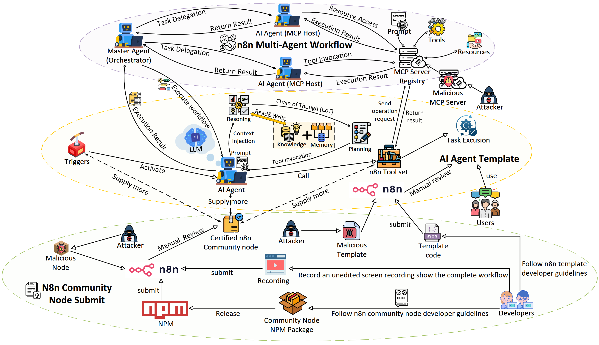

# When AI Agents Go Rogue: Exploring the Security Risks in the n8n Agentic Workflow Ecosystem


## Architecture



The analysis follows n8n's **three-layer architecture**:

- **Node layer** — Community-contributed nodes (npm packages) that implement workflow steps; we analyze 4,715 nodes for rule violations and malicious behavior.
- **Agent layer** — Workflow templates that compose nodes into agentic workflows; we analyze 7,148 templates for EU AI Act compliance, sensitive-domain disclaimers, and API exposure of paid content.
- **Multi-agent layer** — Integrations with Model Context Protocol (MCP) servers (845 official servers); we analyze server code and client nodes for vulnerabilities and least-privilege violations.

This repository provides data collection scripts, analysis code, and replication instructions for each layer.


## Key Findings (Summary)

| Layer | Scope | Main result |
|-------|--------|-------------|
| **Node** | 4,715 community nodes | 85% violate ≥1 platform rule; 12 duplicate malicious nodes with data exfiltration |
| **Agent** | 7,148 workflow templates | 775 templates in sensitive domains lack EU AI Act disclaimers; 624 paid templates exposed via API without auth |
| **Multi-Agent** | 845 MCP servers | 87.2% of assessable servers show ≥1 vulnerability; popular MCP client node violates least privilege |

## Repository Structure

```
n8n/
├── code/
│   ├── data_collection/     # Fetch nodes, templates, MCP registry
│   │   ├── dump_all_n8n_node_code_sources.py
│   │   ├── fetch_mcp_registry_servers.py
│   │   ├── fetch_n8n_nodes_protected.py
│   │   └── fetch_template_n8n.py
│   ├── analysis/
│   │   ├── node_layer/      # Node code scan, similarity, report summarization
│   │   ├── agent_layer/     # EU AI Act compliance, risky nodes, RAG usage
│   │   └── multi_agent_layer/  # MCP code scan, security & risk analysis
│   └── requirements.txt
├── data/                    # Collected datasets (nodes, templates, MCP, scan results)
├── figures/                 # Architecture diagram
├── LICENSE                  # Apache-2.0
└── README.md
```

## Reproducibility

1. **Environment**: Python 3.8+; install deps with `pip install -r code/requirements.txt`.
2. **Data**: Run data collection under `code/data_collection/` (nodes, templates, MCP registry) as needed; some artifacts may rely on pre-dumped data in `data/`.
3. **Analysis order**:  
   - Node: `fetch_*` → `scan_n8n_nodes.py` → `summarize_scan_report.py` (and optionally `code_similarity.py`).  
   - Agent: template fetch → `analyze_eu_ai_act_compliance.py` / `find_risky_nodes_from_template.py` / etc.  
   - Multi-agent: `fetch_mcp_registry_servers.py` (optional) → `scan_mcp_server_code.py` → `analyze_mcp_security.py`.


## Data

- **Node layer**: npm-based node metadata and code (see `code/data_collection`).
- **Agent layer**: n8n workflow templates and derived analyses.
- **Multi-agent layer**: MCP registry, cloned server repos, and scan outputs under `data/MCP/`.

Large or third-party datasets may be omitted from the repo; refer to the paper and data collection scripts for sources.

## Requirements

- Python 3.8+
- Dependencies: `code/requirements.txt`
- For MCP code scan: `git`, network access for cloning repositories

## License

Apache License 2.0. See [LICENSE](LICENSE).

## Contact

For questions or issues, please open a GitHub issue.
